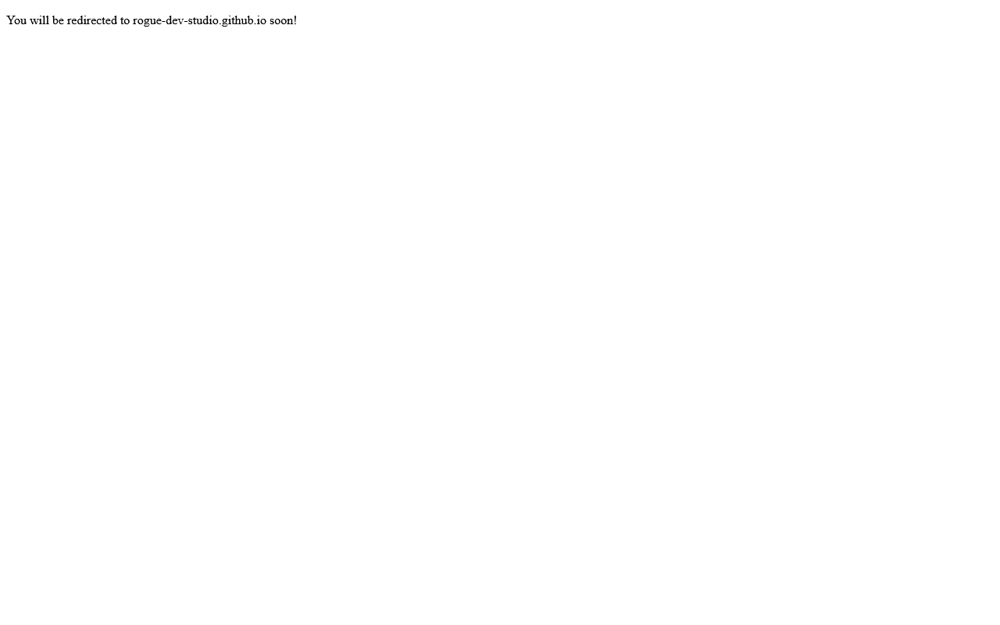

# Astronaut 3D

Lightweight 3D astronaut demo page.



**Live demo:** [https://rogue-dev-studio.github.io/astronaut-3d/](https://rogue-dev-studio.github.io/astronaut-3d/)

## Highlights
- Static demo entry
- Pairs with the model-viewer experiment

## Run
Open `index.html` locally (Live Server on port **5500**), or use the live demo above.

```bash
git clone https://github.com/rogue-dev-studio/astronaut-3d.git
```

By [Aris Hadisopiyan](https://rogue-dev-studio.github.io/) / Rogue Dev Studio.

MIT
